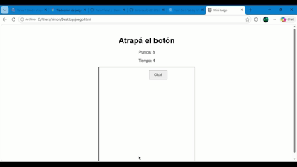

  

# Atrapa el Botón 

Un minijuego interactivo a contrarreloj donde los jugadores ponen a prueba sus reflejos intentando hacer clic en un botón que se mueve antes de que el tiempo se agote.

## Características

- **Sistema de tiempo:** Juega contra el reloj para conseguir la mayor puntuación posible.
- **Dificultad dinámica:** El botón cambia de posición cada vez que haces clic (o por un intervalo de tiempo).
- **Diseño adaptable:** Jugable en diferentes tamaños de pantalla.

##  Tecnologías utilizadas

- **HTML5** - Estructura
- **CSS3** - Estilos y animaciones
- **JavaScript** - Lógica del juego e interactividad

##  Cómo jugar

1. Haz clic en **Iniciar juego**.
2. Haz clic en el botón la mayor cantidad de veces posible antes de que el contador llegue a cero.
3. ¡Intenta superar tu récord de puntuación!

## Instalación y uso

1. Clona el repositorio:
  git clone https://github.com/Saimoon99/Juego.git
